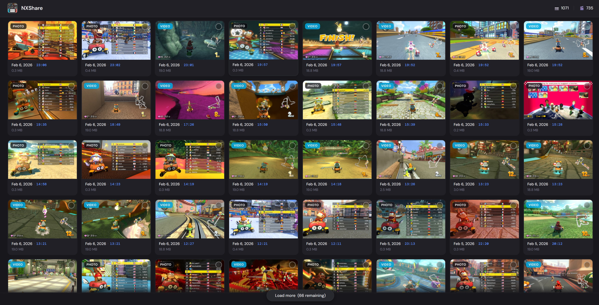

# NXShare

**A Nintendo Switch Homebrew app to transfer your screenshots and videos to any device via browser.**



---

## What it does

NXShare starts a small web server on your Switch. Open the displayed URL in any browser on your phone or PC (same WiFi required), and you get a clean gallery view of all your screenshots and videos — with thumbnails, filters, multi-select download, and QR code scanning.

- 🎬 Browse all screenshots and videos with thumbnails  
- ⬇️ Download individual files or select multiple at once
- 🔍 Filter by screenshots, videos, or by game
- 🎮 Game filter — shows which game each screenshot/video is from
- 📱 Works on any browser — phone, tablet, PC
- ⟳ Refresh the gallery without restarting the app

## Screenshots


---

## Compatibility

| | |
|---|---|
| **Atmosphère** | 1.11.1 and above |
| **Firmware** | tested on 22.0.0 |
| **Storage** | SysMMC and emuMMC (auto-detected) |

---

## Installation

1. Download the latest `NXShare.nro` from the [Releases](../../releases) page
2. Copy it to the `switch/` folder on your SD card
3. Launch via the Homebrew Launcher

---

## Usage

1. Make sure your Switch is connected to WiFi
2. Launch NXShare from the Homebrew Launcher
3. The screen shows a URL and QR code
4. Open that URL in any browser on the same network, or scan the QR code
5. Browse, preview and download your media

---

## Building from source

See [BUILD.md](BUILD.md) for detailed instructions.

```bash
pacman -S switch-dev
git clone https://github.com/musebrot1/NXShare
cd NXShare
make all
```

---

## Credits

- **[libnx](https://github.com/switchbrew/libnx)** by switchbrew — Nintendo Switch homebrew library (ISC License)
- **[devkitPro](https://devkitpro.org)** — ARM toolchain and build system
- **[NXGallery](https://github.com/iUltimateLP/NXGallery)** by iUltimateLP — inspiration for capsa API usage

---

## License

MIT License — see [LICENSE](LICENSE) for details.
