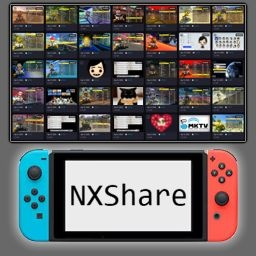

# NXShare

**A Nintendo Switch Homebrew app to transfer your screenshots and videos to any device via browser.**



---

## What it does

NXShare starts a small web server on your Switch. Open the displayed URL in any browser on your phone or PC (same WiFi required), and you get a clean gallery view of all your screenshots and videos — with thumbnails, filters, and one-click downloads.

- 📷 Browse all screenshots with thumbnails
- 🎬 Browse all videos with thumbnails
- ⬇️ Download individual files or select multiple at once
- 🔍 Filter by screenshots or videos
- 📱 Works on any browser — phone, tablet, PC
- ⟳ Refresh the gallery without restarting the app

## Screenshots


---

## Compatibility

| | |
|---|---|
| **Atmosphère** | 1.9.0 and above |
| **Firmware** | Tested on 22.0.0 |
| **Storage** | SysMMC and emuMMC (auto-detected) |

---

## Installation

1. Download the latest `NXShare.nro` from the [Releases](../../releases) page
2. Copy it to the `switch/` folder on your SD card
3. Launch via the Homebrew Launcher

NXShare is also available on the **Homebrew App Store**.

---

## Usage

1. Make sure your Switch is connected to WiFi
2. Launch NXShare from the Homebrew Launcher
3. The screen shows a URL like `http://192.168.x.x:8080`
4. Open that URL in any browser on the same network
5. Browse, preview and download your media

---

## Building from source

### Requirements

- [devkitPro](https://devkitpro.org/wiki/Getting_Started) with `switch-dev` installed
- Windows: use the devkitPro MSYS2 terminal

### Steps

```bash
# Install dependencies (in devkitPro MSYS2 terminal)
pacman -S switch-dev

# Clone and build
git clone https://github.com/musebrot/NXShare
cd NXShare
make all
```

The compiled `NXShare.nro` will appear in the project root.

For a detailed step-by-step Windows guide, see [BUILD.md](BUILD.md).

---

## Credits

- **[libnx](https://github.com/switchbrew/libnx)** by switchbrew — Nintendo Switch homebrew library (ISC License)
- **[devkitPro](https://devkitpro.org)** — ARM toolchain and build system
- **[NXGallery](https://github.com/iUltimateLP/NXGallery)** by iUltimateLP — inspiration for using the Nintendo capsa API (`capsaLoadAlbumFileThumbnail`, `capsaOpenAlbumMovieStream`) for thumbnail and video access

---

## License

MIT License — see [LICENSE](LICENSE) for details.
