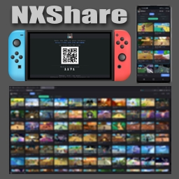
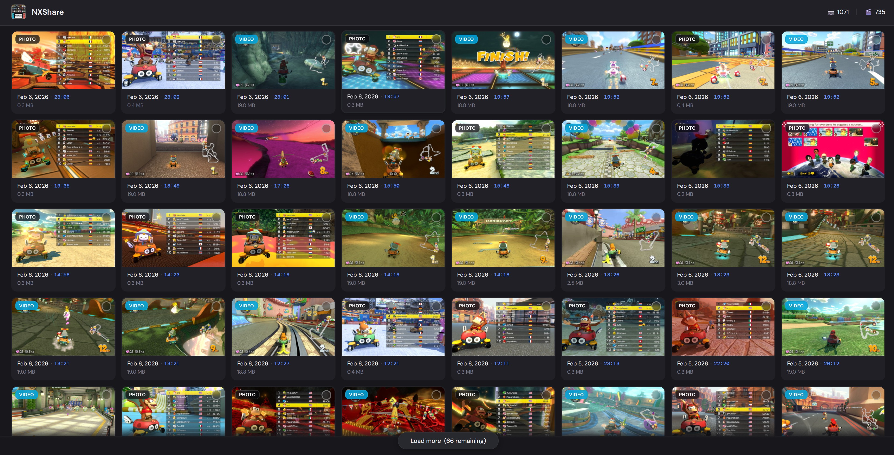

# NXShare

**A Nintendo Switch Homebrew app to transfer your screenshots and videos to any device via browser.**



---

## What it does

NXShare lets you browse and download the Screenshots and Videos of the Switch Album in any browser connected to the same network.


## Screenshots



---

## Installation

Download the latest `NXShare.nro` from the [Releases](../../releases) page and copy it to the `switch/` folder on your SD card


NXShare is also available in the Homebrew App Store

---

## Usage

- Launch NXShare from the Homebrew Launcher (Applet Mode)
- The screen shows a URL / QR code. Open the URL in any browser on the same network, or scan the QR code
-  Browse, preview and download your media

---

## Building from source

See [BUILD.md](BUILD.md) for detailed instructions.

```bash
pacman -S switch-dev
git clone https://github.com/musebrot1/NXShare
cd NXShare
make all
```

---

## Credits

- **[libnx](https://github.com/switchbrew/libnx)** by switchbrew — Nintendo Switch homebrew library (ISC License)
- **[devkitPro](https://devkitpro.org)** — ARM toolchain and build system
- **[NXGallery](https://github.com/iUltimateLP/NXGallery)** by iUltimateLP — inspiration for capsa API usage

---

## License

MIT License — see [LICENSE](LICENSE) for details.
